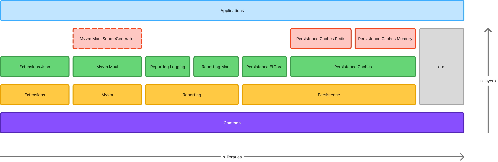

# 💡 Sumapap

Sumapap is **not a framework** — It is a set of opinionated adapters and composition helpers that integrate best-in-class .NET libraries into consistent, production-ready application architectures.

> [`SingleScope`](https://github.com/muhirwanto-dev/singlescope-plugins/tree/main) is no longer maintained and has been replaced by `Sumapap`.

## 🤔 What is included in this repository?

This repository contains several .NET libraries that can be used with `.NET 10` and can be expanded to support additional frameworks and platforms. I also use these libraries in my own applications and keep improving them as new ideas come up during development.

| Package | Description | Latest Version | Download |
| --- | --- | --- | --- |
| [Sumapap.Ddd](https://github.com/muhirwanto-dev/sumapap/blob/main/docs/Sumapap.Ddd.md) | A lightweight Domain-Driven Design (DDD) abstractions focuses on core building blocks used to model rich domains. | [](https://www.nuget.org/packages/Sumapap.Ddd/) |  |
| [Sumapap.Ddd.Dispatcher](https://github.com/muhirwanto-dev/sumapap/blob/main/docs/Sumapap.Ddd.Dispatcher.md) | Provides a simple mechanism to publish batches of `IDomainEvent` instances to their corresponding `IDomainEventHandler<TEvent>` implementations. | [](https://www.nuget.org/packages/Sumapap.Ddd.Dispatcher/) |  |
| [Sumapap.Ddd.Mediator](https://github.com/muhirwanto-dev/sumapap/blob/main/docs/Sumapap.Ddd.Mediator.md) | Adapts domain events to a [`Mediator`](https://github.com/martinothamar/Mediator) pipeline so your domain layer remains free from `Mediator` dependencies while allowing application-level `Mediator` handlers to process domain events. | [](https://www.nuget.org/packages/Sumapap.Ddd.Mediator/) |  | 
| [Sumapap.Persistence](https://github.com/muhirwanto-dev/sumapap/blob/main/docs/Sumapap.Persistence.md) | Set of persistence abstractions and utilities intended to simplify implementing repositories, specifications and unit-of-work patterns across different data access technologies | [](https://www.nuget.org/packages/Sumapap.Persistence/) |  | 
| [Sumapap.Persistence.EfCore](https://github.com/muhirwanto-dev/sumapap/blob/main/docs/Sumapap.Persistence.EfCore.md) | EF Core-based implementations of the persistence abstractions defined in `Sumapap.Persistence`. | [](https://www.nuget.org/packages/Sumapap.Persistence.EfCore/) |  | 

# ⭐ Naming Convention

```jsx
Sumapap.<Capability>.<Technology>
```

# 🚩 Layer Diagram



The image is a **layered architecture diagram** showing how different libraries and modules are organized and layered to support a scalable system.

The diagram is arranged **vertically (bottom → top)** to show dependency direction:

- Bottom = **most foundational**
- Top = **application-level usage**

# 🚀 Getting Started

Please read the documentation for each respective library in the [/docs](https://github.com/muhirwanto-dev/sumapap/tree/main/docs) folder.

# 💪 Support

If you like this project and want to support it, you can [buy me a coffee︎](https://buymeacoffee.com/muhirwanto.dev). Your coffee will keep me awake while developing this project ☕.

<p align="center">
  <a href="https://buymeacoffee.com/muhirwanto.dev">
    
  </a>
</p>
